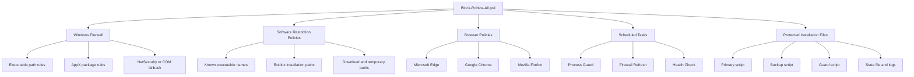

<div align="center">

# Roblox Block for Windows

### Silent, multi-layer Roblox blocking for Windows 10 and Windows 11

[](#release-v003)
[](#requirements)
[](#compatibility)
[](#how-it-works)

**Version 0.0.3**

</div>

---

> [!WARNING]
> Use this project only on computers you own or are authorized to administer.
> The script applies machine-wide firewall, registry, browser, scheduled-task,
> process-control, and Software Restriction Policy changes.

> [!IMPORTANT]
> The initial installation must be started from an **elevated Windows PowerShell
> session**. This means Windows PowerShell must be opened with
> **Run as administrator** before the script is executed.

## Table of contents

- [Overview](#overview)
- [Features](#features)
- [How it works](#how-it-works)
- [Requirements](#requirements)
- [Quick start](#quick-start)
- [How to open elevated PowerShell](#how-to-open-elevated-powershell)
- [Installation](#installation)
- [Command modes](#command-modes)
- [Verification](#verification)
- [Installed components](#installed-components)
- [Logging and monitoring](#logging-and-monitoring)
- [Security and reliability](#security-and-reliability)
- [Performance](#performance)
- [Compatibility](#compatibility)
- [Corporate deployment](#corporate-deployment)
- [Code signing](#code-signing)
- [Troubleshooting](#troubleshooting)
- [Uninstallation](#uninstallation)
- [Release v0.0.3](#release-v003)
- [Disclaimer](#disclaimer)

## Overview

`Block-Roblox-All.ps1` is a production-oriented PowerShell solution that
blocks Roblox through several independent Windows security layers.

It is intended for:

- parental-control scenarios;
- shared or managed Windows computers;
- standalone workstations;
- domain-joined endpoints;
- GPO, SCCM/MECM, Intune, RMM, or other software-deployment workflows.

The script is designed to operate silently and autonomously after deployment.
It does not require a permanently open console window or an interactive user
session.

## Features

### Network blocking

- Blocks outbound Roblox traffic through Windows Defender Firewall.
- Uses the PowerShell `NetSecurity` module when available.
- Supports a Windows Firewall COM fallback when `NetSecurity` is unavailable.
- Creates deterministic, idempotent rules for discovered Roblox executable
  paths.
- Supports Microsoft Store/AppX package-specific firewall rules when package
  information is available.
- Warns when one or more Windows Firewall profiles are disabled.

### Application execution blocking

- Creates machine-level Software Restriction Policy rules.
- Blocks known Roblox executable names.
- Blocks common Roblox installation, update, download, and temporary paths.
- Covers desktop Roblox, Roblox Studio, installers, launchers, crash handlers,
  and Microsoft Store installations.

### Process enforcement

- Stops Roblox processes that are already running during installation or
  repair.
- Installs a hidden process guard running as `NT AUTHORITY\SYSTEM`.
- Uses `Win32_ProcessStartTrace` events instead of continuously enumerating all
  running processes.
- Falls back to targeted polling if WMI process-start events are unavailable.
- Detects and terminates the Microsoft Store process only when its executable
  path belongs to the Roblox package.

### Browser blocking

- Blocks `roblox.com` and `rbxcdn.com` in Microsoft Edge.
- Blocks the same domains in Google Chrome.
- Adds a Mozilla Firefox `WebsiteFilter` policy.
- Preserves unrelated browser policy entries.
- Uses atomic Firefox policy-file updates to reduce the risk of corrupted JSON.

### Autonomous maintenance

- Searches known Roblox locations for newly installed or updated executables.
- Adds missing firewall rules automatically.
- Performs periodic health checks.
- Repairs missing or modified managed components.
- Keeps protected primary and backup copies of the deployment script.
- Supports silent refresh, repair, and uninstall operations.

### Production controls

- Supports `-WhatIf` for safe change simulation.
- Supports `-Verbose` for detailed diagnostic output.
- Supports optional Windows Event Log integration.
- Supports optional Authenticode signature enforcement.
- Uses structured JSON Lines logging.
- Rotates log files.
- Applies changes idempotently.
- Rolls back changes made by the current run after a critical deployment
  failure where restoration is technically possible.

## How it works



The blocking layers are intentionally independent. If one mechanism is
unavailable or overridden, the remaining mechanisms continue to provide
protection.

## Requirements

### Supported operating systems

- Windows 10
- Windows 11
- 32-bit and 64-bit installations
- Standalone and domain-joined computers

### PowerShell

- Windows PowerShell 5.1 or later

The script may be launched from PowerShell 7, but Windows-specific maintenance
components use native Windows PowerShell 5.1 for maximum Windows 10/11
compatibility.

### Required permissions

- Local administrator privileges for installation
- Local administrator privileges for repair
- Local administrator privileges for uninstallation

Restricted users should use **standard Windows accounts**, not administrator
accounts. A local administrator can remove or disable the controls installed by
this project.

### Windows components

The script uses available built-in Windows components and applies graceful
fallbacks where possible:

- Windows Defender Firewall;
- `NetSecurity`;
- `ScheduledTasks`;
- AppX cmdlets;
- CIM/WMI;
- Windows Registry;
- Windows Event Log, when enabled.

## Quick start

### 1. Download the script

Download:

```text
Block-Roblox-All.ps1
```

For the examples in this README, place it in:

```text
C:\Users\<USERNAME>\AppData\w_temp\Block-Roblox-All.ps1
```

Create the directory when necessary:

```powershell
New-Item `
    -Path "$env:USERPROFILE\AppData\w_temp" `
    -ItemType Directory `
    -Force
```

### 2. Open Windows PowerShell as Administrator

Follow the detailed instructions in
[How to open elevated PowerShell](#how-to-open-elevated-powershell).

### 3. Simulate the installation first

Run:

```powershell
powershell.exe `
    -NoLogo `
    -NoProfile `
    -NonInteractive `
    -ExecutionPolicy Bypass `
    -File "$env:USERPROFILE\AppData\w_temp\Block-Roblox-All.ps1" `
    -WhatIf `
    -Verbose
```

This displays planned operations without applying system changes.

### 4. Install

Run:

```powershell
powershell.exe `
    -NoLogo `
    -NoProfile `
    -NonInteractive `
    -WindowStyle Hidden `
    -ExecutionPolicy Bypass `
    -File "$env:USERPROFILE\AppData\w_temp\Block-Roblox-All.ps1"
```

### 5. Verify

Open a new elevated PowerShell session and run:

```powershell
Get-ScheduledTask -TaskName "RobloxBlock-*"
```

Then inspect the log:

```powershell
Get-Content `
    "C:\ProgramData\RobloxBlock\RobloxBlock.jsonl" `
    -Tail 50
```

## How to open elevated PowerShell

An **elevated PowerShell session** is a PowerShell window running with local
administrator rights.

### Method 1: Start menu

1. Open the Windows **Start** menu.
2. Type:

   ```text
   Windows PowerShell
   ```

3. Right-click **Windows PowerShell**.
4. Select **Run as administrator**.
5. When User Account Control asks whether the application may make changes,
   select **Yes**.
6. Confirm that the title bar begins with:

   ```text
   Administrator: Windows PowerShell
   ```

### Method 2: Win+X menu

1. Press `Win + X`.
2. Select **Windows PowerShell (Admin)** or **Terminal (Admin)**.
3. Approve the User Account Control prompt.

On newer Windows 11 builds, Windows Terminal may open instead. Make sure its
PowerShell tab is running with administrator privileges.

### Verify administrator rights

Run:

```powershell
([Security.Principal.WindowsPrincipal] `
    [Security.Principal.WindowsIdentity]::GetCurrent()
).IsInRole(
    [Security.Principal.WindowsBuiltInRole]::Administrator
)
```

Expected result:

```text
True
```

A result of `False` means the window is not elevated.

### Why elevation is required

Installation changes machine-wide resources:

- `HKLM` registry policies;
- Windows Defender Firewall;
- Software Restriction Policies;
- files under `C:\ProgramData`;
- scheduled tasks running as `SYSTEM`;
- optional Windows Event Log source registration.

The script intentionally does not rely on an interactive UAC prompt during
silent enterprise deployment.

## Installation

### Standard silent installation

From an elevated PowerShell session:

```powershell
powershell.exe `
    -NoLogo `
    -NoProfile `
    -NonInteractive `
    -WindowStyle Hidden `
    -ExecutionPolicy Bypass `
    -File "$env:USERPROFILE\AppData\w_temp\Block-Roblox-All.ps1"
```

### Installation with verbose diagnostics

```powershell
powershell.exe `
    -NoLogo `
    -NoProfile `
    -NonInteractive `
    -ExecutionPolicy Bypass `
    -File "$env:USERPROFILE\AppData\w_temp\Block-Roblox-All.ps1" `
    -Verbose
```

Do not use `-WindowStyle Hidden` when you want to read verbose console output.

### Installation with Windows Event Log integration

```powershell
powershell.exe `
    -NoLogo `
    -NoProfile `
    -NonInteractive `
    -WindowStyle Hidden `
    -ExecutionPolicy Bypass `
    -File "$env:USERPROFILE\AppData\w_temp\Block-Roblox-All.ps1" `
    -EnableEventLog
```

### Installation with signature enforcement

Use this mode only after signing the script with a trusted code-signing
certificate:

```powershell
powershell.exe `
    -NoLogo `
    -NoProfile `
    -NonInteractive `
    -WindowStyle Hidden `
    -ExecutionPolicy Bypass `
    -File "$env:USERPROFILE\AppData\w_temp\Block-Roblox-All.ps1" `
    -RequireValidSignature `
    -EnableEventLog
```

### Custom maintenance intervals

Example:

```powershell
powershell.exe `
    -NoLogo `
    -NoProfile `
    -NonInteractive `
    -WindowStyle Hidden `
    -ExecutionPolicy Bypass `
    -File "$env:USERPROFILE\AppData\w_temp\Block-Roblox-All.ps1" `
    -RefreshIntervalHours 6 `
    -HealthCheckIntervalHours 24
```

## Command modes

### Standard installation or repair

Running the script without a mode parameter installs the solution or repairs
the existing deployment.

```powershell
.\Block-Roblox-All.ps1
```

The operation is idempotent: repeated runs reconcile the desired configuration
instead of intentionally creating duplicate managed resources.

### `-WhatIf`

Simulates supported changes:

```powershell
.\Block-Roblox-All.ps1 -WhatIf -Verbose
```

Use this before initial deployment and before changing enterprise deployment
packages.

### `-Verbose`

Displays detailed processing information:

```powershell
.\Block-Roblox-All.ps1 -Verbose
```

Structured logs are written independently of verbose console output.

### `-RefreshOnly`

Updates only the firewall layer:

```powershell
powershell.exe `
    -NoLogo `
    -NoProfile `
    -NonInteractive `
    -WindowStyle Hidden `
    -ExecutionPolicy Bypass `
    -File "C:\ProgramData\RobloxBlock\Block-Roblox-All.ps1" `
    -RefreshOnly
```

`RefreshOnly`:

- scans known Roblox locations;
- discovers current executable paths;
- adds or repairs managed firewall rules;
- reconciles AppX package rules when AppX information is available.

`RefreshOnly` does **not**:

- modify SRP;
- modify browser policies;
- recreate scheduled tasks;
- rewrite the guard script;
- rewrite installed payload files;
- terminate running processes.

### `-RepairOnly`

Performs a full health reconciliation of managed components:

```powershell
powershell.exe `
    -NoLogo `
    -NoProfile `
    -NonInteractive `
    -WindowStyle Hidden `
    -ExecutionPolicy Bypass `
    -File "C:\ProgramData\RobloxBlock\Block-Roblox-All.ps1" `
    -RepairOnly
```

This mode is normally used by the health-check and process-guard components.

### `-Uninstall`

Removes managed blocking components:

```powershell
powershell.exe `
    -NoLogo `
    -NoProfile `
    -NonInteractive `
    -WindowStyle Hidden `
    -ExecutionPolicy Bypass `
    -File "C:\ProgramData\RobloxBlock\Block-Roblox-All.ps1" `
    -Uninstall
```

### `-PreserveLogs`

Keeps logs during uninstall:

```powershell
powershell.exe `
    -NoLogo `
    -NoProfile `
    -NonInteractive `
    -WindowStyle Hidden `
    -ExecutionPolicy Bypass `
    -File "C:\ProgramData\RobloxBlock\Block-Roblox-All.ps1" `
    -Uninstall `
    -PreserveLogs
```

### `-EnableEventLog`

Enables additional reporting to the Windows `Application` log with source:

```text
RobloxBlock
```

### `-RequireValidSignature`

Refuses installation, refresh, repair, or removal when the active script does
not have a valid trusted Authenticode signature.

## Verification

### Verify scheduled tasks

```powershell
Get-ScheduledTask -TaskName "RobloxBlock-*" |
    Select-Object TaskName, State
```

Expected task names:

```text
RobloxBlock-ProcessGuard
RobloxBlock-AutoRefresh
RobloxBlock-HealthCheck
```

### Verify firewall rules

Using `NetSecurity`:

```powershell
Get-NetFirewallRule -Group "RobloxBlock" |
    Select-Object DisplayName, Enabled, Direction, Action
```

Inspect executable paths:

```powershell
Get-NetFirewallRule -Group "RobloxBlock" |
    Get-NetFirewallApplicationFilter |
    Select-Object Program, Package
```

Expected rule characteristics:

```text
Enabled   : True
Direction : Outbound
Action    : Block
```

### Verify Windows Firewall profiles

```powershell
Get-NetFirewallProfile |
    Select-Object Name, Enabled
```

Recommended result:

```text
Domain  True
Private True
Public  True
```

The script logs warnings when profiles are disabled. It does not silently
enable profiles because firewall-profile management may be controlled by domain
policy or an endpoint-security platform.

### Verify Edge policy

Open:

```text
edge://policy
```

Locate:

```text
URLBlocklist
```

### Verify Chrome policy

Open:

```text
chrome://policy
```

Locate:

```text
URLBlocklist
```

### Verify Firefox policy

Open:

```text
about:policies
```

Locate the active:

```text
WebsiteFilter
```

### Verify SRP rules

```powershell
Get-ChildItem `
    "HKLM:\SOFTWARE\Policies\Microsoft\Windows\Safer\CodeIdentifiers\0\Paths" `
    -ErrorAction SilentlyContinue |
    ForEach-Object {
        Get-ItemProperty $_.PSPath
    } |
    Where-Object {
        $_.Description -like "RobloxBlock:*"
    } |
    Select-Object Description, ItemData
```

### Verify installed file hashes

```powershell
Get-FileHash `
    "C:\ProgramData\RobloxBlock\Block-Roblox-All.ps1" `
    -Algorithm SHA256

Get-FileHash `
    "C:\ProgramData\RobloxBlock\Block-Roblox-All.backup.ps1" `
    -Algorithm SHA256
```

### Check the last task results

```powershell
Get-ScheduledTaskInfo -TaskName "RobloxBlock-ProcessGuard"
Get-ScheduledTaskInfo -TaskName "RobloxBlock-AutoRefresh"
Get-ScheduledTaskInfo -TaskName "RobloxBlock-HealthCheck"
```

## Installed components

Default installation directory:

```text
C:\ProgramData\RobloxBlock
```

Typical files:

```text
C:\ProgramData\RobloxBlock\
|-- Block-Roblox-All.ps1
|-- Block-Roblox-All.backup.ps1
|-- RobloxProcessGuard.ps1
|-- state.json
|-- RobloxBlock.jsonl
|-- RobloxProcessGuard.jsonl
`-- rotated log files
```

### Scheduled tasks

```text
RobloxBlock-ProcessGuard
RobloxBlock-AutoRefresh
RobloxBlock-HealthCheck
```

### Firewall group

```text
RobloxBlock
```

### Windows Event Log source

When enabled:

```text
RobloxBlock
```

## Logging and monitoring

### Main structured log

```text
C:\ProgramData\RobloxBlock\RobloxBlock.jsonl
```

### Process guard log

```text
C:\ProgramData\RobloxBlock\RobloxProcessGuard.jsonl
```

### Read recent events

```powershell
Get-Content `
    "C:\ProgramData\RobloxBlock\RobloxBlock.jsonl" `
    -Tail 100
```

### Follow the process guard log

```powershell
Get-Content `
    "C:\ProgramData\RobloxBlock\RobloxProcessGuard.jsonl" `
    -Wait
```

### Parse JSON Lines

```powershell
Get-Content `
    "C:\ProgramData\RobloxBlock\RobloxBlock.jsonl" |
    ForEach-Object {
        $_ | ConvertFrom-Json
    } |
    Select-Object TimestampUtc, Level, Component, EventId, Message
```

### Filter errors

```powershell
Get-Content `
    "C:\ProgramData\RobloxBlock\RobloxBlock.jsonl" |
    ForEach-Object {
        $_ | ConvertFrom-Json
    } |
    Where-Object Level -eq "Error"
```

### Windows Event Log

When `-EnableEventLog` is configured:

```powershell
Get-WinEvent `
    -FilterHashtable @{
        LogName = "Application"
        ProviderName = "RobloxBlock"
    } `
    -MaxEvents 100
```

JSON Lines logs are always the primary diagnostic source. Windows Event Log
integration is optional and intended for centralized collection systems.

## Security and reliability

### Administrative privilege check

The script verifies membership in the local Administrators group without
writing temporary privilege-test files.

If elevation is unavailable, the script exits without applying machine-wide
changes.

### Protected installation directory

The installation directory is restricted to:

- `NT AUTHORITY\SYSTEM`;
- local Administrators.

The script checks for unsafe reparse points before privileged file writes.

### Atomic writes

Critical files are written through temporary sibling files and replaced
atomically where supported:

- Firefox `policies.json`;
- state file;
- guard script;
- installed primary and backup scripts.

This reduces the chance of leaving a truncated or partially written policy
file after a crash or power failure.

### Input and state validation

The script validates:

- trusted installation path ownership;
- state-file schema;
- known state properties;
- SHA-256 value format;
- scheduled-task definitions;
- managed rule identities;
- browser policy entries.

### Rollback

During installation or repair, the script registers rollback actions for
reversible changes created by the current run.

Rollback may restore:

- files;
- previous file contents;
- registry values;
- SRP rules;
- browser policy entries;
- Firefox policy data;
- newly created firewall rules;
- previous scheduled-task XML definitions;
- Event Log source registration;
- safe previous ACLs.

Some actions are inherently irreversible, such as terminating an already
running Roblox process.

### Idempotency

Repeated execution is designed not to intentionally duplicate:

- firewall rules;
- SRP rules;
- browser URL entries;
- scheduled tasks;
- installed payload files;
- managed state records.

Managed resources are identified through deterministic names and fingerprints.

### Self-healing

Periodic health checks verify:

- primary script integrity;
- backup script integrity;
- guard-script presence and content;
- scheduled tasks;
- firewall rules;
- SRP rules;
- Edge policy;
- Chrome policy;
- Firefox policy.

Missing or modified managed components are reconciled automatically.

## Performance

The implementation minimizes long-running background overhead:

- event-driven process detection;
- targeted process queries;
- no continuous packet capture;
- no permanent `pktmon` session;
- no continuous full-disk scan;
- scans limited to known Roblox locations;
- `[IO.Directory]::EnumerateFiles` for efficient file discovery;
- reusable filters for `Roblox*.exe` and Store-package `*.exe`;
- cached profile and AppX discovery within a run;
- existing firewall-rule names loaded into case-insensitive hash sets;
- browser and SRP reconciliation excluded from `RefreshOnly`;
- `gpupdate` executed only after relevant SRP changes;
- configurable refresh and health-check intervals.

## Compatibility

### Windows editions

The script is designed for Windows 10 and Windows 11, including Home editions
where some enterprise-oriented modules or management features may be missing.

Fallback behavior is used where possible.

### 32-bit and 64-bit systems

The implementation accounts for:

- missing `ProgramFiles(x86)` on 32-bit systems;
- 32-bit PowerShell running on 64-bit Windows;
- native Windows PowerShell relaunch when required;
- multiple user profile paths;
- damaged or inaccessible profile registry entries.

### NetSecurity unavailable

When `NetSecurity` cannot be loaded, the script attempts to use the Windows
Firewall COM API.

### AppX unavailable

When AppX cmdlets are unavailable:

- AppX package discovery is skipped gracefully;
- executable-path firewall blocking remains active;
- existing package-specific managed rules are not blindly removed when their
  current package state cannot be verified.

### CIM/WMI unavailable

If CIM or WMI is unavailable:

- Store-process path validation may be limited;
- the process guard uses a targeted fallback;
- other blocking layers remain active;
- warnings are written to the structured log.

### Domain environments

Domain Group Policy, MDM, endpoint security, or application-control policies
may override local configuration.

The script reports conflicts where detectable but does not attempt to defeat
centrally managed security policy.

## Corporate deployment

### GPO startup script

Recommended approach:

1. Store the signed script in a read-only SYSVOL location.
2. Configure a computer startup script.
3. Run it under the computer account.
4. Use `-RequireValidSignature`.
5. Enable Event Log integration for central collection.

Example command:

```powershell
powershell.exe `
    -NoLogo `
    -NoProfile `
    -NonInteractive `
    -WindowStyle Hidden `
    -ExecutionPolicy AllSigned `
    -File "\\contoso.local\SYSVOL\contoso.local\scripts\Block-Roblox-All.ps1" `
    -RequireValidSignature `
    -EnableEventLog
```

### SCCM / MECM

Installation command:

```text
powershell.exe -NoLogo -NoProfile -NonInteractive -WindowStyle Hidden -ExecutionPolicy Bypass -File Block-Roblox-All.ps1 -EnableEventLog
```

Uninstall command:

```text
powershell.exe -NoLogo -NoProfile -NonInteractive -WindowStyle Hidden -ExecutionPolicy Bypass -File C:\ProgramData\RobloxBlock\Block-Roblox-All.ps1 -Uninstall
```

Possible detection methods:

- installed primary script exists;
- `state.json` exists and reports version `0.0.3`;
- all three scheduled tasks exist;
- firewall group contains enabled outbound block rules.

### Intune

Deploy as a Win32 application or device-context PowerShell script.

Recommended settings:

- run using the logged-on credentials: **No**;
- run script in 64-bit PowerShell: **Yes**;
- enforce script signature check: according to corporate policy;
- use device context;
- collect exit codes and logs.

### RMM tools

Run under `SYSTEM` or an elevated service account. Do not run the initial
deployment under a standard interactive user account.

## Code signing

### Check the current signature

```powershell
Get-AuthenticodeSignature ".\Block-Roblox-All.ps1" |
    Format-List
```

### Sign the script

```powershell
$certificate = Get-ChildItem Cert:\CurrentUser\My -CodeSigningCert |
    Select-Object -First 1

Set-AuthenticodeSignature `
    -FilePath ".\Block-Roblox-All.ps1" `
    -Certificate $certificate `
    -TimestampServer "<corporate timestamp server>"
```

For enterprise deployment, use a certificate issued by a trusted corporate or
public code-signing authority and a trusted timestamp service.

### Enforce the signature

```powershell
.\Block-Roblox-All.ps1 `
    -RequireValidSignature `
    -EnableEventLog
```

Do not modify a signed script after signing it. Any content change invalidates
the signature.

## Troubleshooting

### The script appears to do nothing

Silent operation is expected.

Run without `-WindowStyle Hidden` and add `-Verbose`:

```powershell
powershell.exe `
    -NoLogo `
    -NoProfile `
    -NonInteractive `
    -ExecutionPolicy Bypass `
    -File ".\Block-Roblox-All.ps1" `
    -Verbose
```

Then inspect:

```text
C:\ProgramData\RobloxBlock\RobloxBlock.jsonl
```

### Administrator rights are missing

Verify:

```powershell
([Security.Principal.WindowsPrincipal] `
    [Security.Principal.WindowsIdentity]::GetCurrent()
).IsInRole(
    [Security.Principal.WindowsBuiltInRole]::Administrator
)
```

The result must be `True`.

### Roblox still reaches the network

Check Windows Firewall profiles:

```powershell
Get-NetFirewallProfile |
    Select-Object Name, Enabled
```

Check managed rules:

```powershell
Get-NetFirewallRule -Group "RobloxBlock"
```

Run an immediate refresh:

```powershell
powershell.exe `
    -NoLogo `
    -NoProfile `
    -NonInteractive `
    -ExecutionPolicy Bypass `
    -File "C:\ProgramData\RobloxBlock\Block-Roblox-All.ps1" `
    -RefreshOnly `
    -Verbose
```

### Browser policies are not visible

Fully close and reopen the browser.

Review:

```text
edge://policy
chrome://policy
about:policies
```

In Chromium browsers, select the policy reload option.

### A scheduled task is missing

Run a repair:

```powershell
powershell.exe `
    -NoLogo `
    -NoProfile `
    -NonInteractive `
    -ExecutionPolicy Bypass `
    -File "C:\ProgramData\RobloxBlock\Block-Roblox-All.ps1" `
    -RepairOnly `
    -Verbose
```

### The process guard is not running

```powershell
Get-ScheduledTask -TaskName "RobloxBlock-ProcessGuard"
Get-ScheduledTaskInfo -TaskName "RobloxBlock-ProcessGuard"
```

Review:

```text
C:\ProgramData\RobloxBlock\RobloxProcessGuard.jsonl
```

### Firefox policy JSON was already invalid

The script does not overwrite an existing invalid Firefox JSON policy file
without safely parsing it.

Manually validate or repair:

```text
<Firefox installation directory>\distribution\policies.json
```

Then rerun installation or `-RepairOnly`.

### AppX detection is unavailable

Review the log for AppX warnings.

Desktop executable blocking, SRP, browser policies, and the process guard can
still operate even when AppX package discovery is unavailable.

### `NetSecurity` is unavailable

The script attempts a COM firewall fallback.

Review the structured log to confirm which firewall backend was selected.

### Exit codes

Common documented exit codes include:

| Code | Meaning |
|---:|---|
| `0` | Operation completed successfully |
| `1` | Unhandled or critical deployment failure |
| `2` | The script could not determine a valid execution path |
| `3` | Firewall initialization or update failed |
| `5` | Administrator privileges are required |
| `6` | Signature validation failed |

Deployment systems should also collect the structured log because it contains
more detailed component-level error information than an exit code alone.

## Uninstallation

### Standard silent uninstall

Open an elevated Windows PowerShell session and run:

```powershell
powershell.exe `
    -NoLogo `
    -NoProfile `
    -NonInteractive `
    -WindowStyle Hidden `
    -ExecutionPolicy Bypass `
    -File "C:\ProgramData\RobloxBlock\Block-Roblox-All.ps1" `
    -Uninstall
```

### Uninstall while preserving logs

```powershell
powershell.exe `
    -NoLogo `
    -NoProfile `
    -NonInteractive `
    -WindowStyle Hidden `
    -ExecutionPolicy Bypass `
    -File "C:\ProgramData\RobloxBlock\Block-Roblox-All.ps1" `
    -Uninstall `
    -PreserveLogs
```

The uninstall operation removes only resources managed by this project,
including:

- scheduled tasks;
- managed firewall rules;
- managed browser URL entries;
- managed Firefox policy entries;
- managed SRP rules;
- process guard;
- installation state and payload files, subject to the selected log-retention
  option.

Unrelated existing browser policies, firewall rules, and SRP rules should not
be removed.

## Release v0.0.3

### Highlights

- Production-oriented multi-layer Roblox blocking.
- Transaction-aware deployment and rollback.
- Idempotent installation, refresh, repair, and uninstall.
- Strict `RefreshOnly` isolation.
- Event-driven Roblox process guard.
- Automatic self-healing and component integrity checks.
- Protected primary and backup script copies.
- Structured JSON Lines logs with rotation.
- Optional Windows Event Log integration.
- Optional Authenticode signature enforcement.
- `NetSecurity` firewall backend with COM fallback.
- Graceful AppX, CIM, and WMI degradation.
- Support for Windows 10/11 and PowerShell 5.1+.
- Support for `-WhatIf` and `-Verbose`.
- Improved file enumeration with `[IO.Directory]::EnumerateFiles`.
- Reduced duplicate file-system scans.
- Cleaner function naming and logical code regions.
- Silent uninstall with optional log preservation.

### Recommended GitHub release metadata

```text
Tag: v0.0.3
Release title: Roblox Block for Windows v0.0.3
Target branch: main
```

## Operational notes

### Software Restriction Policies

SRP is retained to preserve the project's required architecture and broad
Windows compatibility.

For new enterprise application-control programs, also evaluate:

- AppLocker;
- App Control for Business;
- Windows Defender Application Control;
- centralized GPO or MDM policy.

### Packet Monitor

The script does not keep `pktmon` running.

`pktmon` is useful for temporary packet diagnostics and dropped-packet
analysis, but it is not required for enforcement. Continuous capture would add
unnecessary overhead and generate trace files.

Actual network blocking is performed by Windows Defender Firewall.

### Browser management notice

Managed browser policies may cause Edge, Chrome, or Firefox to display a notice
such as:

```text
Managed by your organization
```

This is expected when machine-level browser policies are active.

## Security checklist

Before production deployment:

- [ ] Review the complete script.
- [ ] Test `-WhatIf -Verbose`.
- [ ] Validate syntax using the PowerShell parser.
- [ ] Test installation on a Windows 10 VM.
- [ ] Test installation on a Windows 11 VM.
- [ ] Reboot and verify all scheduled tasks.
- [ ] Verify desktop Roblox blocking.
- [ ] Verify Microsoft Store Roblox blocking.
- [ ] Verify Roblox Studio blocking.
- [ ] Verify browser blocking.
- [ ] Verify firewall refresh after a Roblox update.
- [ ] Verify `-RepairOnly`.
- [ ] Verify `-Uninstall`.
- [ ] Verify rollback after an intentionally induced deployment failure.
- [ ] Sign the script for managed production deployment.
- [ ] Pilot deployment on a limited group of endpoints.
- [ ] Configure central collection of logs or Windows events.

## Disclaimer

This project is provided **as is**, without warranty of any kind.

The author and contributors are not responsible for data loss, policy
conflicts, service interruption, or other damage resulting from use of the
script.
